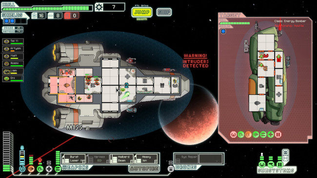

[](https://code-sherpas.rocks)

***Project designed by*** [Code Sherpas](https://code-sherpas.rocks)

# Qué habilidades se pretende poner en práctica

- Poner en práctica el diseño e implementación de una API siguiendo el estilo arquitectónico REST. Las APIs que aplican REST reciben el nombre de RESTful APIs. Recurso recomendado: [restfulapi.net](https://restfulapi.net/)
- Creación de una aplicación web con una interfaz HTTP.
- Creación de una aplicación un dominio complejo (no trivial). Un ejemplo de dominio trivial es un CRUD sin reglas ni restricciones de negocio como el take-home project que ya habéis hecho. Un ejemplo de dominio complejo es un dominio con reglas y restricciones de negocio como puede ser el modelado del videojuego (con sus reglas y mecánicas de juego) de la sesión de pair programming.
- Detectar conceptos de un dominio que tengan datos y comportamiento y diseñarlos con orientación a objetos.
- Experimentar procesos de desarrollo de software iterativos e incrementales.
- Tomar la costumbre de expresar todos los conceptos en inglés en el código.

# Introducción

Este proyecto trata de crear una aplicación web interactiva con una RESTful API (sobre el protocolo HTTP) cuyo dominio modela un simulador de naves espaciales que luchan entre sí.

No es necesario crear una base de datos persistente. Es suficiente con una persistencia que perdure durante la ejecución de la aplicación.

Las reglas y restricciones del dominio están inspiradas en el videojuego [FTL: Faster Than Light](https://store.steampowered.com/app/212680/FTL_Faster_Than_Light/). Aunque estén inspiradas en ese videojuego, solo debemos tener en cuenta las especificaciones y comportamientos que se piden en este documento.



El usuario de nuestra aplicación es un hipotético _Game Master_ que tiene que poder controlar todo lo que pasa en el simulador a través de la API que le facilitemos. Ese «todo» es lo que vamos a ir desarrollando a lo largo del proyecto.

Tened en cuenta que las _features_ van a ser descritas como si el _Game Master_ os pidiera lo que quiere directamente a vosotras/os. Este _Game Master_ no tiene ningún conocimiento técnico por lo que no esperéis detalles técnicos o tecnológicos. El _Game Master_ os va a hablar estrictamente sobre sus necesidades y desde su conocimiento experto acerca de las naves espaciales de ciencia ficción, pero con total desconocimiento sobre aplicaciones web, software, APIs, identificadores, funciones, orientación a objetos y persistencia de datos.
Además, el _Game Master_ no es perfecto describiendo el dominio de los simuladores de batallas espaciales: es posible que no haya contemplado ciertos casos específicos.

# Proceso de desarrollo

A lo largo de este proyecto, se irá pidiendo desarrollar una serie de pequeños comportamientos paso a paso para experimentar un proceso de desarrollo de software iterativo e incremental. Por favor, sigue los pasos en el orden que se muestran para maximizar la facilidad de la evolución de la aplicación. También es necesario que cada funcionalidad que desarrolles esté probada con tests automáticos. Con tests unitarios es suficiente, pero si te sientes más cómodo/a escribiendo otro tipo de tests como tests sobre la API HTTP, también es una opción legítima.

Proceso:
1. Crea un repositorio en GitHub para el proyecto.
2. Elige la siguiente _feature_.
3. Desarróllala junto con sus pruebas automáticas.
4. Graba un video explicando tu diseño e implementación, las pruebas automáticas asociadas y cómo el _Game Master_ puede usar esa funcionalidad a través de la API REST de la aplicación.
5. Comparte el video por slack como en ejercicios anteriores. La primera vez comparte también la URL de tu proyecto.
6. Volver al paso 2.

# Features

## Feature 1

Como _Game Master_ quiero crear una nave espacial. Las naves tienen `health` que se representa con un número entero. Un valor de 0 o menor que 0 significa que la nave está destruida; un valor positivo significa que la nave sigue funcionando. 

## Feature 2

Como _Game Master_ quiero ver todas las naves espaciales creadas.

## Feature 3

Como _Game Master_ quiero poder hacer que una nave cualquiera `A` dispare a otra nave cualquiera `B`. La consecuencia de que `A` dispare a `B` es que la `health` de `B` decrementa en 1.

## Feature 4

Como _Game Master_ quiero que el `health` de las naves no pueda ser negativo. Dicho de otra manera, el `health` nunca podrá decrementar por debajo de 0. Tampoco podrán crearse naves con `health` negativo.

## Feature 5

Como _Game Master_ quiero que las naves no puedan disparar si están destruidas.

## Feature 6

Como _Game Master_ quiero que las naves tengan un arma (`weapon`). A partir de hora, cuando una nave cualquiera `A` dispara a otra nave cualquiera `B`, la nave `A` ordena a su `weapon` que dispare contra `B`.

## Feature 7

Un poco de contexto: _En el año en el que se ambienta este simulador, 2535, ya existen los generadores de electricidad portátiles basados en fusión nuclear que permiten realizar viajes espaciales sin tener que repostar durante décadas_.

Como _Game Master_ quiero que las naves tengan un generador el cual suministra energía a toda la nave: 
- La cantidad de energía total que el generador puede suministrar a la nave en su conjunto en un momento dado se llama `total-power` y es un número entero positivo (0 incluido).
- La cantidad de energía que la nave en su conjunto consume (todavía no existe nada en la nave que consuma energía) nunca puede superar `total-power`.
- La cantidad de `total-power` que la nave no está usando es `power-not-in-use` y es un número entero positivo (0 incluido).
- `power-not-in-use` nunca puede ser más grande que `total-power`.

## Feature 8

A partir de ahora, como _Game Master_, quiero que `weapon` necesite cierta cantidad de energía para funcionar (`weapon-power-needed`, entero mayor que 0):
- La cantidad de energía que `weapon` usa en cada momento se llama `power-consumed-by-weapon` (entero igual a 0 o mayor).
- `power-consumed-by-weapon` no puede ser mayor que `weapon-power-needed`.
- Si `power-consumed-by-weapon` es menor que `weapon-power-needed`, `weapon` no puede disparar.
- `power-consumed-by-weapon` consume la energía que suministra el generador (`power-not-in-use`). Eso significa que la siguiente igualdad debe ser siempre cierta:
```
power-consumed-by-weapon + power-not-in-use = total-power
```
- Por defecto, `weapon` siempre intenta consumir toda la energía que necesita para funcionar. Por el momento, el _Game Master_ no puede elegir cuanta energía consume `weapon` del generador (`power-not-in-use`).

Algunos ejemplos de estados de la nave:
```
total-power: 10
weapon-power-needed: 5
power-consumed-by-weapon: 4
power-not-in-use: 6

El arma no puede disparar porque necesita 5 y está consumiendo 4.
```
```
total-power: 10
weapon-power-needed: 5
power-consumed-by-weapon: 5
power-not-in-use: 5

El arma sí puede disparar porque necesita 5 y está consumiendo 5.
```
```
total-power: 10
weapon-power-needed: 3
power-consumed-by-weapon: 2
power-not-in-use: 8

El arma no puede disparar porque necesita 3 y está consumiendo 2.
```
```
total-power: 10
weapon-power-needed: 3
power-consumed-by-weapon: 3
power-not-in-use: 7

El arma sí puede disparar porque necesita 3 y está consumiendo 3.
```

## Feature 9

Como _Game Master_ quiero poder elegir cuanta energía consume `weapon` (`power-consumed-by-weapon`) en cualquier momento de la simulación. Siempre respetando las reglas mencionadas en _features_ anteriores.
